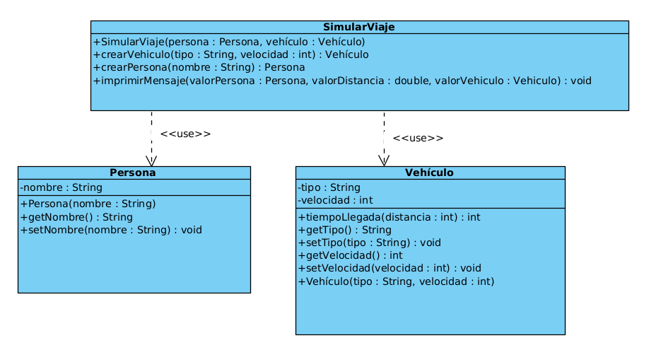

# Nombre: Joaquin Faundez

## Primera Iteracion:

### Clases:

| Clase         |                                                  Descripcion                                                  |                                                                                                       Atributos                                                                                                        |                                                                                                Metodos                                                                                                |
|---------------|:-------------------------------------------------------------------------------------------------------------:|:----------------------------------------------------------------------------------------------------------------------------------------------------------------------------------------------------------------------:|:-----------------------------------------------------------------------------------------------------------------------------------------------------------------------------------------------------:|
| Persona       |                      Requerida para poder simular al usuario que utilizara el vehiculo.                       |                                                                            Nombre, de tipo String, necesario para identificar a la persona.                                                                            |                       "Constructor" con el parametro "Nombre".  "getNombre" para poder imprimirlo por pantalla.  "setNombre" para modificarlo en caso de ser necesario.                       |
| Vehículo      |           Requrida para simular los vehículos que puede utilizar la persona para realizar el viaje.           | Tipo, de tipo String, neceseario para determinar si es un auto, una motocicleta o una bicicleta Velocidad, de tipo entero, necesaria para determinar cuanto tardara el vehiculo en recorrer la distancia indicada. | "Constructor" con los parametros "tipo" y "velocidad". "Tiempo de llegada", que toma como parametro la disntancia recorrida, y retorna el tiempo requerido.  Sus respectivos getter y setter. |
| Simular Viaje | Requerida para llamar a las clases Persona y Vehículo y simular el viaje solicitando las entradas al usuario, |                                                                                                      No requiere.                                                                                                      |                                                  "main", para ejecutar el programa. "Simular Viaje", que intancia los objetos y simula el viaje.                                                  |

### Diagrama de Clases:

___

## Segunda Iteracion: 

### Clases:

| Clase         |                                                  Descripcion                                                  |                                                                                                       Atributos                                                                                                        |                                                                                                                                           Metodos                                                                                                                                            |
|---------------|:-------------------------------------------------------------------------------------------------------------:|:----------------------------------------------------------------------------------------------------------------------------------------------------------------------------------------------------------------------:|:--------------------------------------------------------------------------------------------------------------------------------------------------------------------------------------------------------------------------------------------------------------------------------------------:|
| Persona       |                      Requerida para poder simular al usuario que utilizara el vehiculo.                       |                                                                            Nombre, de tipo String, necesario para identificar a la persona.                                                                            |                                                                  "Constructor" con el parametro "Nombre".  "getNombre" para poder imprimirlo por pantalla.  "setNombre" para modificarlo en caso de ser necesario.                                                                   |
| Vehículo      |           Requrida para simular los vehículos que puede utilizar la persona para realizar el viaje.           | Tipo, de tipo String, neceseario para determinar si es un auto, una motocicleta o una bicicleta Velocidad, de tipo entero, necesaria para determinar cuanto tardara el vehiculo en recorrer la distancia indicada. |                                            "Constructor" con los parametros "tipo" y "velocidad". "Tiempo de llegada", que toma como parametro la disntancia recorrida, y retorna el tiempo requerido.  Sus respectivos getter y setter.                                             |
| Simular Viaje | Requerida para llamar a las clases Persona y Vehículo y simular el viaje solicitando las entradas al usuario, |                                                                    vehiculo1 y persona1, ambos privados de tipo Vehiculo y Persona respectivamente.                                                                    | "main", para ejecutar el programa. "Simular Viaje", que intancia los objetos y simula el viaje. "crearVehiculo" y "crearPersona" requeridos para instanciar los objetos de tipo Persona y de tipo Vehiculo. "imprimirMensaje", necesario para mostrar la informacion solicitada. |

### Diagrama de Clases:
